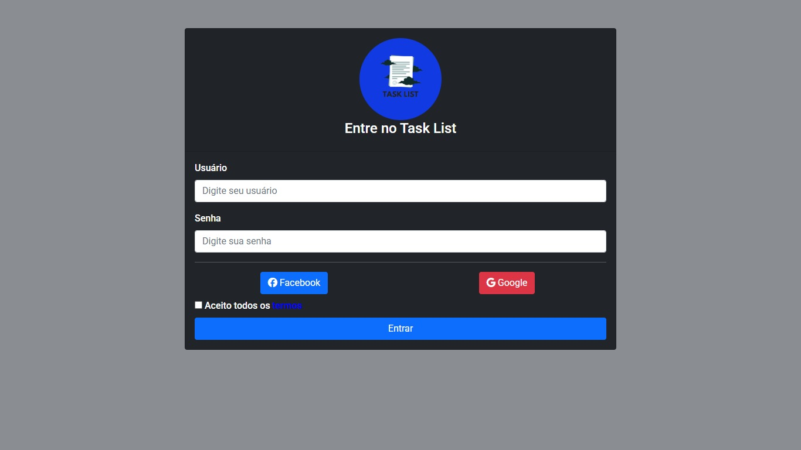
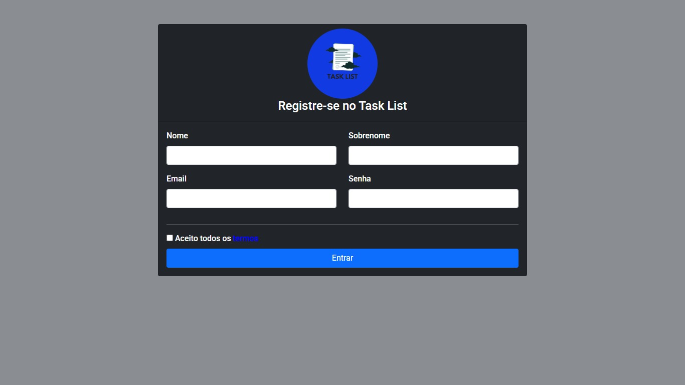

# Projeto TaskList Web

O **TaskList Web** é um projeto desenvolvido para facilitar o gerenciamento de tarefas de forma simples e eficiente. Com uma interface intuitiva, permite criar, visualizar e organizar suas tarefas diárias, tornando o acompanhamento do progresso mais prático e produtivo.

## 🚀 Funcionalidades

- Criar, visualizar, editar e excluir tarefas;
- Marcar tarefas como concluídas;
- Interface limpa e objetiva;
- Sistema leve e responsivo;
- Gerenciamento simples de tarefas diárias.

## ✅ Passo a Passo para Usar o TaskList Web

1. **Acesse o sistema:** Abra o TaskList Web no seu navegador.
2. **Crie uma nova tarefa:** Clique no botão "Adicionar Tarefa" e preencha as informações necessárias, como título e descrição.
3. **Visualize suas tarefas:** Todas as tarefas criadas aparecerão em uma lista organizada na tela principal.
4. **Marque tarefas como concluídas:** Ao finalizar uma tarefa, marque-a como concluída para acompanhar seu progresso.
5. **Edite ou exclua tarefas:** Caso precise, utilize as opções de editar ou remover tarefas existentes.
6. **Organize suas tarefas:** Utilize filtros ou categorias (se disponíveis) para manter suas tarefas organizadas conforme sua necessidade.

---

## 🖼️ Telas do Sistema

### Tela de Login

  

### Tela de Criação de Conta

  

### Tela Inicial

  

### Tela de Criação de Tarefa

  

### Tela de Visualização de Tarefa

  

### Tela de Perfil

  

---

## 👨‍💻 Créditos do Criador

Desenvolvido por [Gabriel](https://github.com/GabrielDev16).

- GitHub: [@GabrielDev16](https://github.com/GabrielDev16)
- Instagram: [@its.gabrzz](https://www.instagram.com/its.gabrzz)

---

📌 **Observação:** este projeto é apenas um exemplo educacional, mas pode ser expandido com autenticação, banco de dados e outras melhorias no futuro.
